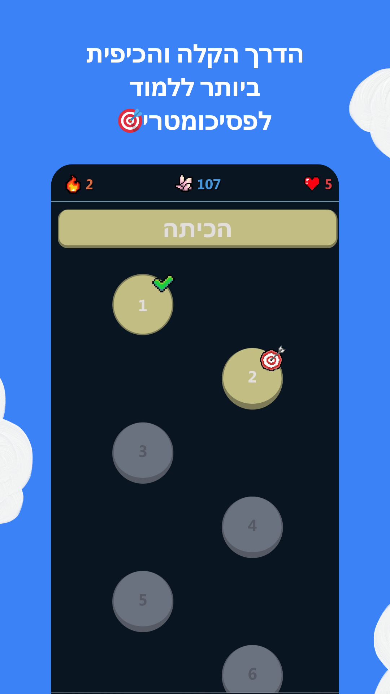
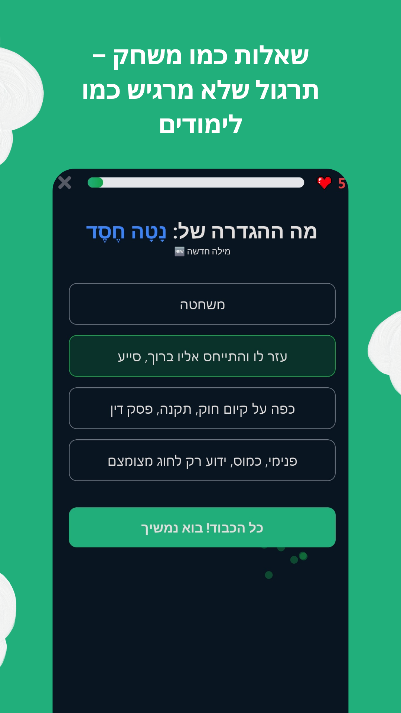
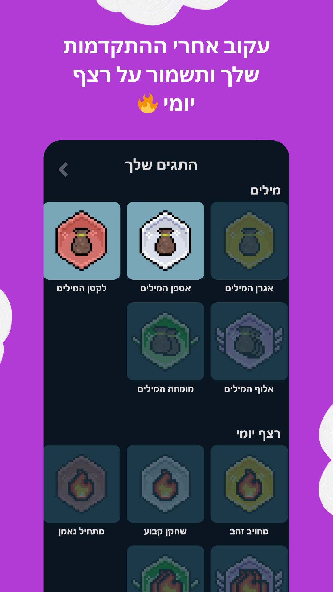
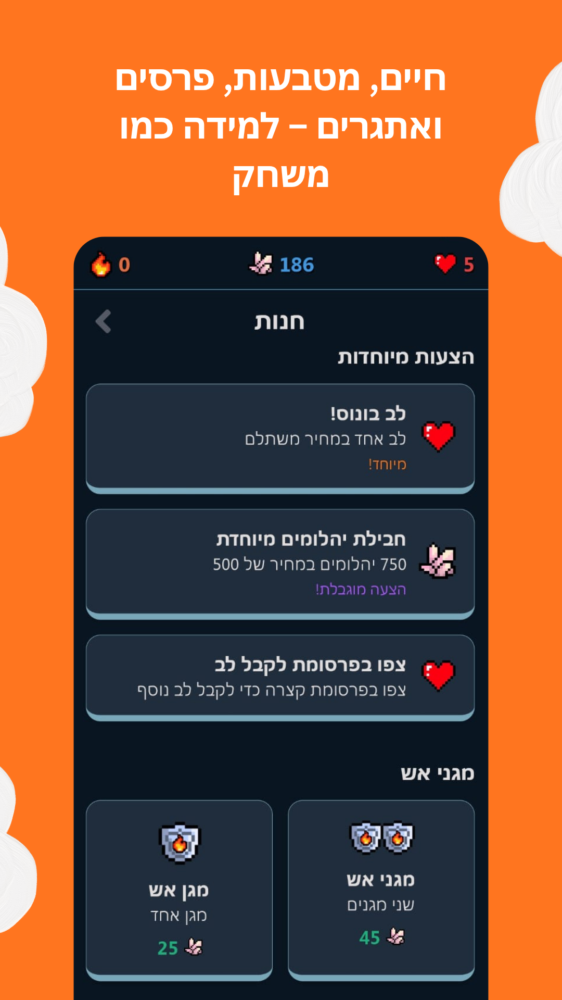
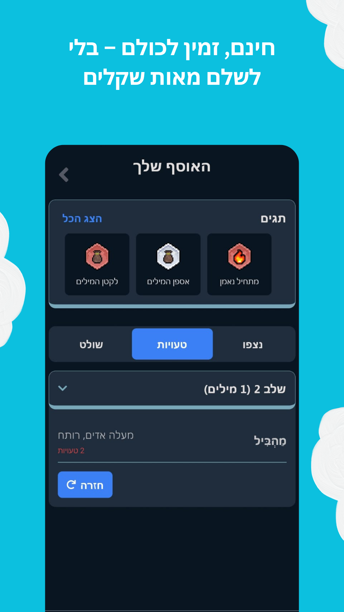
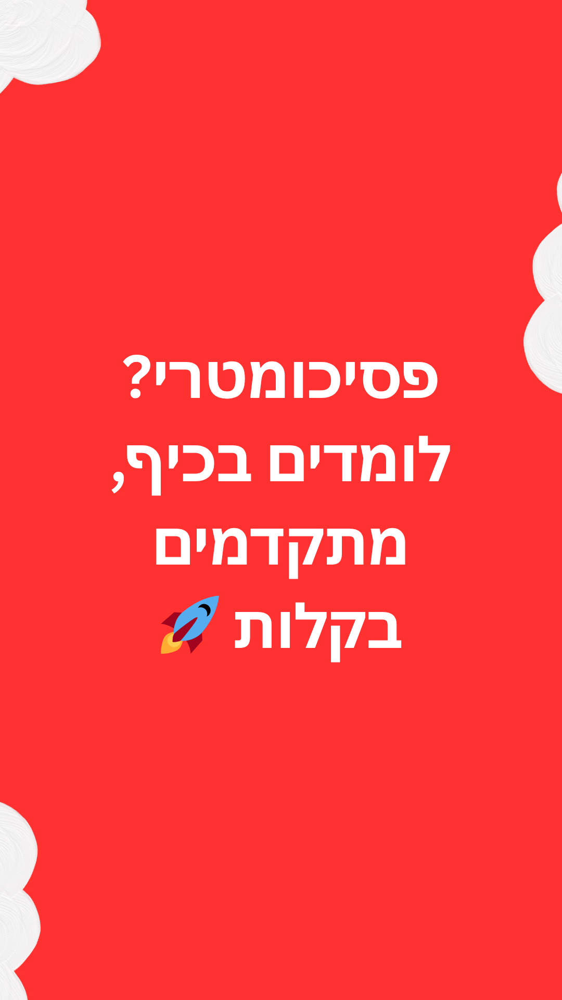

Welcome to **Mascilon** 🎓✨  
Mascilon is a free mobile app that helps students prepare for the Israeli Psychometry exam through fun and interactive games.  
The app focuses on Hebrew vocabulary, sentence completion, and other verbal reasoning skills.

We use **Google Sign-In** to let users easily create an account, save their progress, and sync data across devices.  
Mascilon only requests **basic Google profile information** (email, name, and profile picture) and does **not access any other Google data**.

---

## App Preview

  
  
  
  
  
  

---

Check out our app on the [Google Play Store](https://play.google.com/store/apps/details?id=com.gastudios.mascilon)!

For more information, view our  
[Privacy Policy](privacy-policy.md) | [Terms of Service](terms.md) | [Account Deletion Policy](account-deletion.md)

---

**Contact us:** [gagamestudiosil@gmail.com](mailto:gagamestudiosil@gmail.com)
